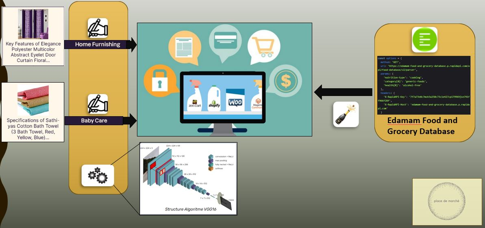

# Deep-learning-data_p6
Livrables réalisés pour le projet "Classifiez automatiquement des biens de consommation" (projet n°6) OpenClassroom.

## Contexte Première Partie :

Vous êtes Data Scientist chez "Place de marché", une entreprise lançant une marketplace e-commerce anglophone où les vendeurs postent des articles avec photo et description. Actuellement, les catégories d'articles sont attribuées manuellement, ce qui est inefficace.
Linda, la Lead Data Scientist, vous demande d'étudier la faisabilité d'un moteur de classification automatique des articles en utilisant à la fois le texte et l'image.

## Contexte Seconde Partie :

Après avoir démontré la faisabilité de la classification automatique des articles, vous devez poursuivre l'analyse d'images et explorer de nouvelles fonctionnalités.

## Etapes : 

* Prétraitement des données : Nettoyage des descriptions textuelles et des images des produits.
* Extraction de features : 
Pour les images : Utiliser SIFT, ORB, SURF, et CNN Transfer Learning.
Pour les textes : Utiliser bag-of-words, Tf-idf, Word2Vec, BERT, et USE.
* Analyse visuelle et mesure de faisabilité : Calculer la similarité entre les catégories réelles et celles issues de la segmentation en clusters pour confirmer l'analyse visuelle.
* Classification supervisée des images : Mettre en place un modèle de classification supervisée pour les images des produits. Utiliser des techniques de data augmentation pour améliorer les performances du modèle.
* Extension à l'épicerie fine : Extraire les 10 premiers produits à base de "champagne" via une API spécifiée et les enregistrer dans un fichier ".csv" avec les champs foodId, label, category, foodContentsLabel, et image.

## Livrables :
* **Gamba_Lucas_1_notebook_pretraitement_feature_extraction_faisaibilite_042024** : Un notebook de prétraitement et extraction de features (réduction dimensionnelle, visualisation.)
* **Gamba_Lucas_2_notebook_classification_04_2024** : notebook de la classification des images avec VGG16 précédée d'une mesure de la similarité des clusters pour valider la faisabilité de la classification automatique.
* **Gamba_Lucas_3_script_Python_042024** : Un notebook pour l'extraction et le formatage des données des produits "champagne".
* **Gamba_Lucas_4_presentation_042024** : Un support de présentation en PDF (30 slides maximum) résumant toute la démarche et les résultats d'analyse les plus pertinents.
